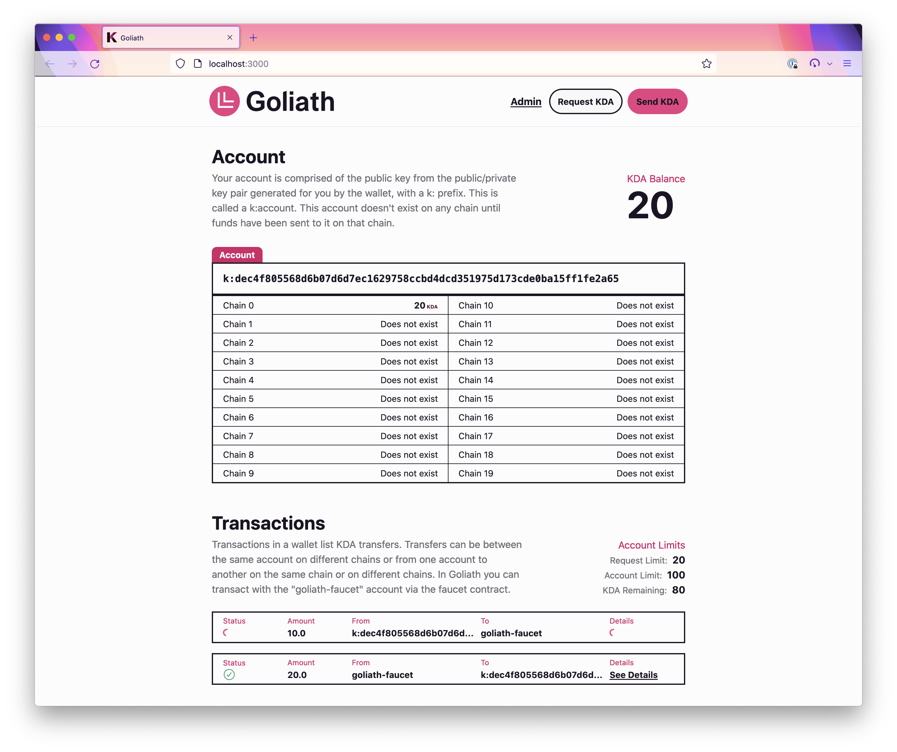

# Goliath Wallet Project

The Goliath wallet is a TypeScript + React frontend that interacts with Kadena's Chainweb blockchain. It is a minimal but complete frontend application, intended for developers who have built a React application before but are newcomers to Pact and Chainweb. This project builds on the [smart contract we developed in Project 1](../01/faucet-contract/) and demonstrates how to:

- Use the [pact-lang-api](https://github.com/kadena-io/pact-lang-api) library to send transactions to a Chainweb node for execution and read th results.
- Query our local Chainweb node for information on one chain or across all 20 chains (for example, to retrieve an account's balance on all chains).
- Write an interface for interacting with the faucet smart contract we developed in Project 1

Goliath is a fully-functioning frontend; I encourage you to run it yourself, make tweaks, and view the results! If you are using the provided Nix shell, then you can use the following commands to run Goliath:

```sh
# Enter the Nix shell (use nix-shell if your Nix installation does not support flakes)
nix develop

# Start the simulation blockchain (run devnet-stop to stop the simulation)
devnet-start

# Fund the faucet account and deploy the faucet contract
faucet-deploy

# Start the Goliath application (Ctrl+C to exit)
goliath-start
```

This project deals only with the frontend part of building a dapp on Chainweb. I highly recommend that you spend time with [the smart contract project](../01-faucet-contract) before moving on to this one, as this project interacts with the faucet contract we developed.

## Wallet Overview

The Goliath wallet is a simple test wallet for Kadena. It assumes you have `devnet` running and have deployed the faucet contract; this frontend makes requests to the faucet contract on your local Chainweb node, just the same way that you'll make requests to a production Chainweb node when you develop your own applications.

### Features

The Goliath wallet is a simple test wallet for sending and receiving KDA. When you load Goliath in your browser you will be given a new wallet address with no funds. Then, the wallet will request 15 KDA on your behalf from the faucet contract.



After that, you can begin to transfer funds using your wallet! The wallet UI is made up of three sections: the navbar, account details, and transaction details.

The navbar provides three actions you can take:

- The "Admin" action allows you to act as the faucet account and update how the faucet contract works (ie. raise or lower the per-request and per-account limits).
- The "Receive Funds" action allows you to request funds from the faucet account to your account on Chain 0.
- The "Send Funds" action allows you to transfer funds from your account on Chain 0 to another chain or back to the faucet account.

The account details section displays your account and KDA holdings across all chains. Each time a transfer is processed your balances are refreshed via a call to the `details` function from the foundational `coin` contract.

Finally, the transaction details section lists each transaction associated with your account. When you initiate a transaction it will be added to the list, and then it will result in a success or failure result and render the associated data from the response.

### Development

You can use the command below to start the wallet frontend in development mode. Feel free to make changes to the source code – the UI will hot-reload with your changes. Remember: this will only work if you are running devnet!

```sh
pnpm run dev
```

You may wish to open the developer tools with the console and/or network tabs open so that you can see the various requests, responses, and logs we receive from our local Chainweb node.

## Project Structure

The code specific to our wallet is in the `src` directory:

- `App.tsx` is our application. It initializes data, stores the app state, and assembles our UI from our theme components.
- `pact-utils` is a helper library built on top of `pact-lang-api` that provides TypeScript definitions for `pact-lang-api`, helpers for writing Pact code in JavaScript, a request builder module that makes it easy to build requests for Chainweb, and a collection of React Hooks for integrating requests into your UI. Feel free to use this code in your own projects!
- `contracts` contains TypeScript implementations of our faucet smart contract and some of the `coin-v5` contract. You should read this file and the [faucet smart contract it describes](../01-faucet-contract/faucet.pact) side-by-side. You can also compare the requests to the [request files](../01-faucet-contract/yaml) from Project 1, so you can see how the same requests translate to the request builder.
- `components` contains a few Goliath-specific components, such as the modals for setting account limits, requesting funds, and returning funds.
- `config.ts` contains configuration specific to our application, such as the network ID and chain that our requests will target and the keypairs for various accounts our wallet will control.
- `accounts.ts` contains the account details (addresses, public and private keys) for accounts used by the wallet. In the real world **never** commit your private keys; these are included for demonstration only.

There is also some code not stored in this directory because it is used both for the wallet and for the [Charkha lending protocol project](../03-charkha-lending/). Specifically:

- [`theme`](../theme) contains the various UI components used to build both frontends. These are typical frontend code and have nothing to do with Pact or Chainweb specifically. This code is not commented.
