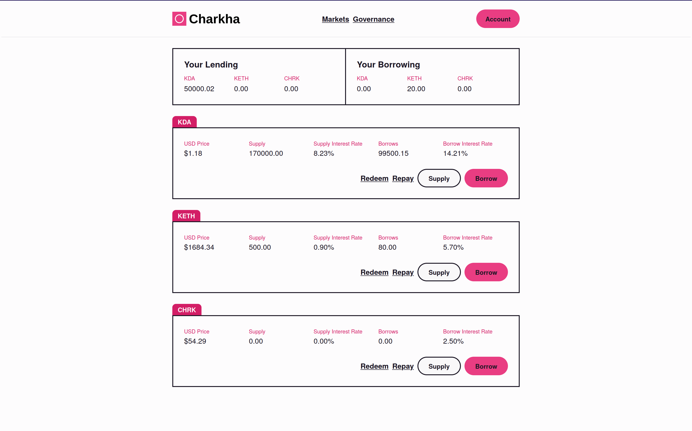
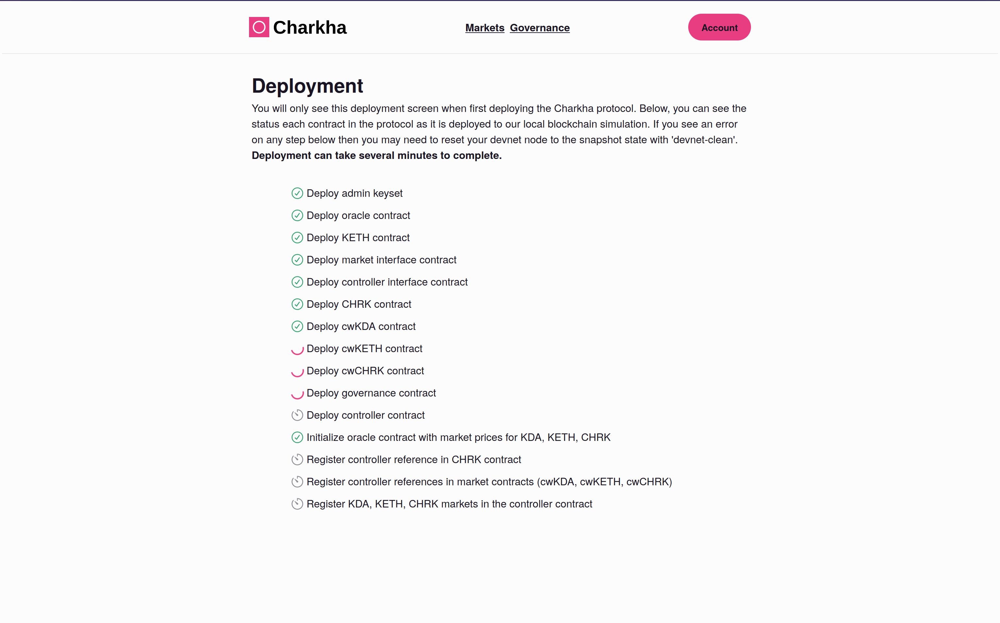

# Charkha Lending Project

The Charkha lending protocol is a complete decentralized lending app built on Kadena's Chainweb blockchain. Decentralized finance has been one of the standout uses of smart contracts and Charkha is inspired by the popular [Compound](https://compound.finance) lending protocol.

Charkha contains all the components of a real-world DeFi project, including:

1. The [Charkha white paper](./Charkha-Protocol-Whitepaper.pdf) which describes the protocol in depth, and which you should read first (it also has [a collection of examples](./Charkha-Protocol-Examples.pdf)).
2. A [development guide](./guide), which explains how we translated the white paper into smart contract implementations.
3. A collection of [thoroughly-commented smart contracts](./contracts) that implement the protocol and tests.
4. A complete [TypeScript + React frontend](./frontend) that shows the current markets and their interest rates and allows you to lend and borrow assets, submit governance proposals, liquidate under-collateralized accounts, and more.

As you read through the white paper, contracts, and frontend, you'll see how to:

- Develop sophisticated, real-world smart contracts to implement a "white paper" spec
- Bring off-chain data to the blockchain (real-world asset prices, for example)
- Implement your own tokens according to the KIP-0005 token standard
- Design a rewards accrual system that incentivizes participation in the protocol
- Establish community governance for our smart contracts, where participants submit proposals and vote on protocol changes with their CHRK reward holdings
- Take full advantage of decentralization by designing features that require no participation from an administrator — including borrowing real-world assets like KDA
- Navigate around smart contract performance limitations by establishing index values, snapshotting to the database, and more

Finally, Charkha is a fully-functioning lending protocol with a corresponding frontend. I encourage you to run the app yourself, lend some funds, submit some governance proposals, and earn some interest!

## Features

Charkha is a lending application that supports several markets. In the main "markets" page you can see your lending and borrowing activity and the current state of the markets supported in the protocol. Asset prices are recorded in USD using the Charkha oracle contract.



Charkha also allows the community to create and vote on proposals to change the protocol itself. Charkha participants earn the CHRK rewards token by participating in markets and can use this token to vote on proposals. Here's an open proposal that changes the base borrower interest rate in the KDA market:


To fully explore Charkha, please read the white paper and run the application locally!

## Run the Application

Assuming you have cloned this repository and initialized the `devnet` submodule as described in the main README, you can run Charkha yourself with a simulation of Chainweb with:

```sh
# Add your CoinMarketCap API key to the .env file (see the development guide for
# instructions on getting your own API key):
echo "VITE_CMC_API_KEY=<your-key>" >> 03-charkha-lending/frontend/.env

# Enter the Nix shell (use nix-shell if your Nix installation does not support flakes)
nix develop

# Start the simulation blockchain (run devnet-stop to stop the simulation and devnet-clean to reset to a clean state).
devnet-start

# Start the Charkha frontend (Ctrl+C to exit)
charkha-start
```

If successful, you will see the deployment screen:


