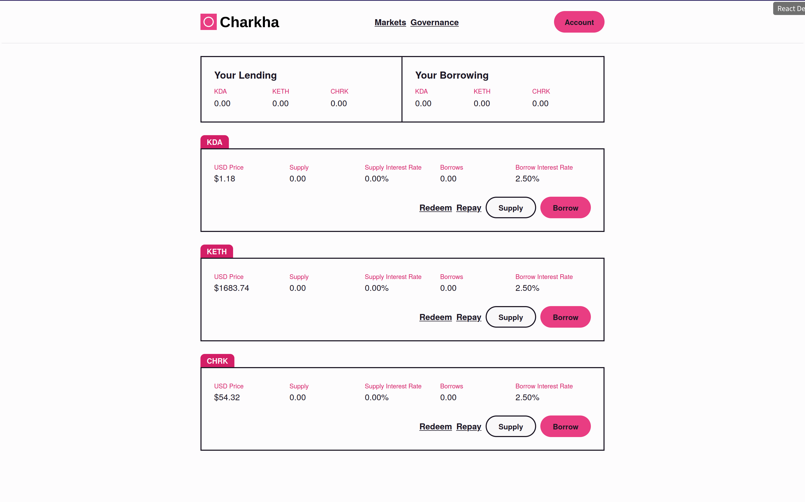
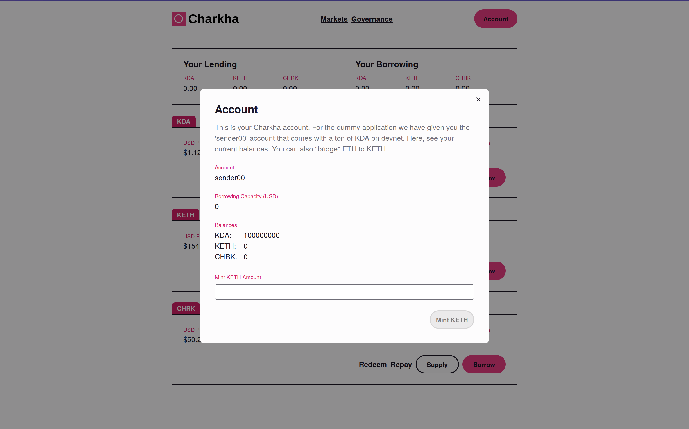
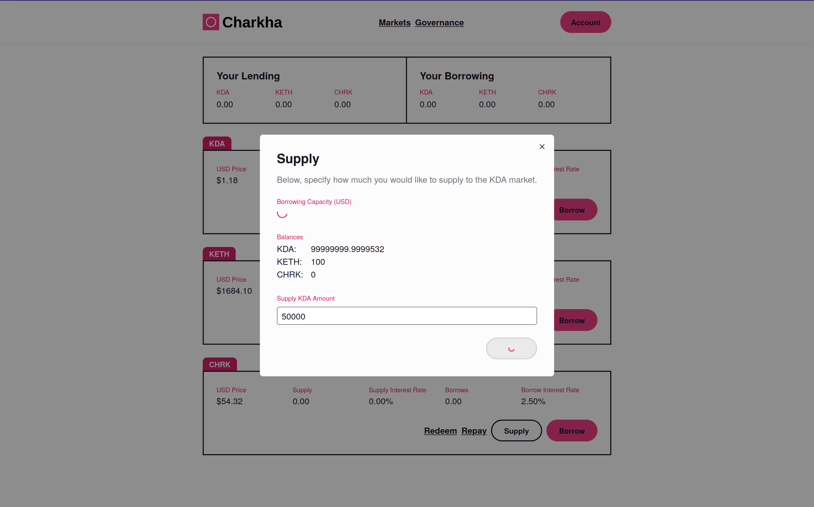
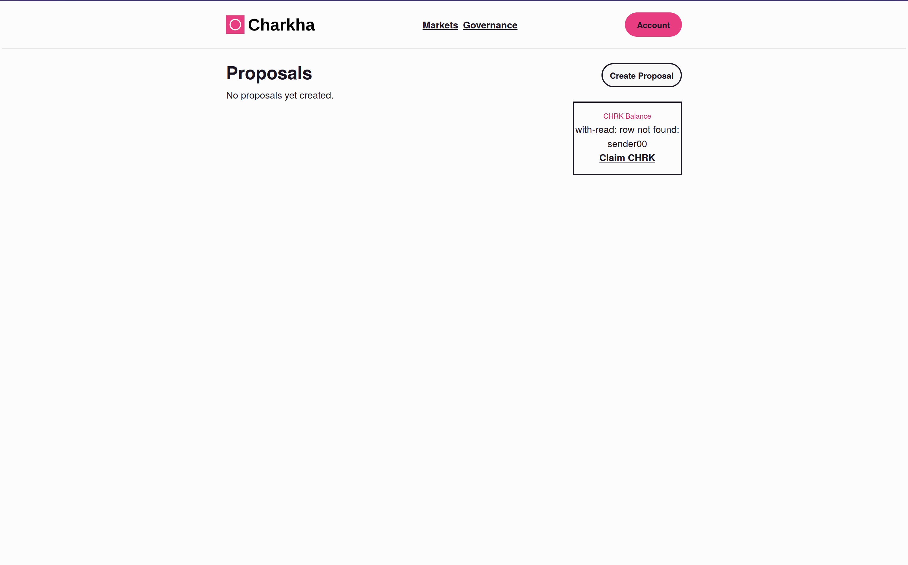
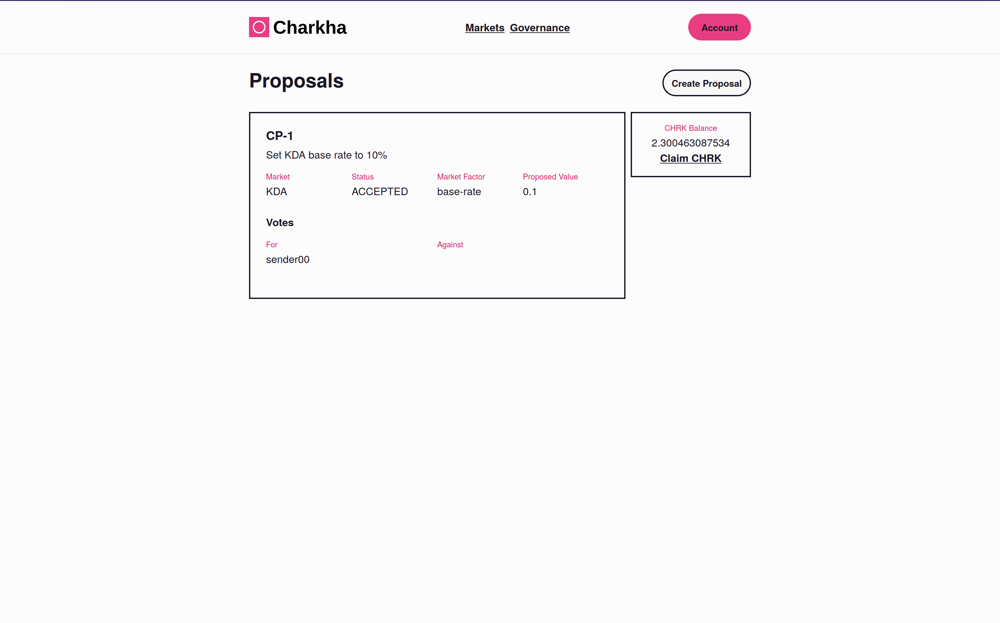
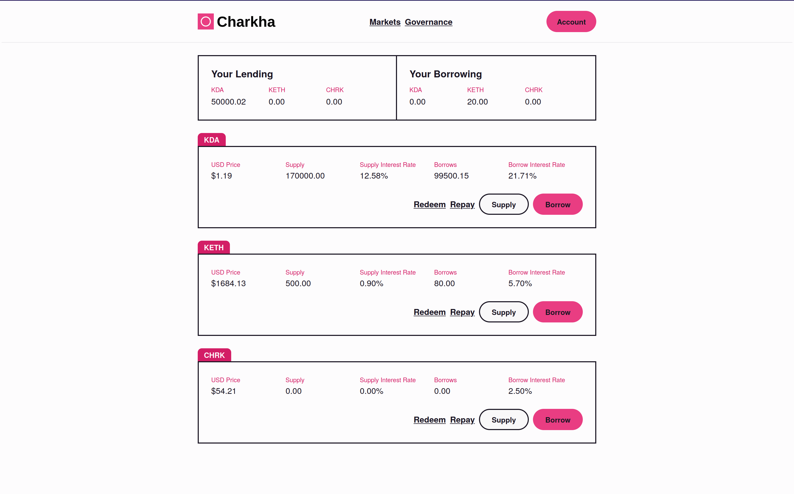

# Charkha UI

The Charkha frontend directory contains TypeScript + React code for the lending protocol frontend. This provides a pleasant interface to explore the protocol and is a small example of writing an app that uses Chainweb as its backend. It is not thoroughly-commented simply because this is a Pact demonstration and not a React one.

## In Action

When you first load the application you will see the deployment screen. This screen only renders if you haven't deployed the protocol yet. Once deployed, you won't see this screen anymore.

The protocol begins with three markets and fresh price data from CoinMarketCap to seed the oracle contract. Markets have so suppliers or borrowers at first, so they are all static.

The top of the application is the navbar and includes a modal for you to look at your account balances and, if you want, bridge ETH to KETH. At first your account simply shows your KDA balance, as you have no other assets yet.

The application automatically kicks off some lending activity using accounts that already exist on devnet (sender01 and sender02). Here's the markets page once there are some lenders and borrowers — notice the change in interest rates! Interest rates and exchange rates will continue to be calculated in the background by the protocol.

You are able to participate in the markets, too. Let's lend some KDA and start earning interest and CHRK reward tokens:

Next, let's turn to the community governance features of Charkha. At first, there are no proposals and you haven't earned any CHRK tokens.

We can try to submit a proposal, but if you don't have any CHRK tokens then you're not eligible to participate in community governance:

Let's claim our CHRK tokens from the governance page that we've earned by participating in the KDA market. It's only been a few blocks so we haven't earned much:

However, it's enough to submit a new proposal to change the KDA market base rate to 10%. This is the base interest rate charged to borrows before utilization and the multiplier are factored in. We can also create proposals to change those market factors, too.

Proposals must stay open for a specified period of time before voting can be closed. If you try to close the proposal early you'll see an error message. While we wait, let's look at the KDA market interest rates before our change:

Then we can close voting on our proposal — since we were the only voters, the proposal passes.

We can now see the effect of community governance on the markets by an increase in interest rates paid in the KDA market:

You can also see through these screenshots that our oracle has been updating in the background! Notice, for example, that KDA has slightly changed in price.

### Wrapping Up

You can run the application with `charkha-start` if you are using the Nix development shell and with `pnpm run dev` in this directory otherwise.
